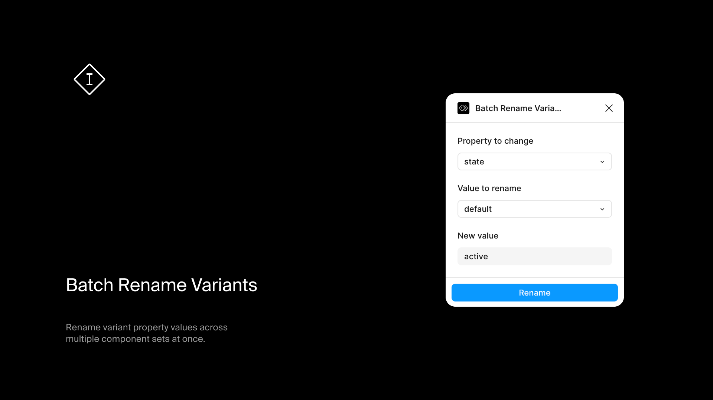

# Batch Rename Variants

A Figma plugin for renaming variant property values across multiple component sets at once.

## Install

Get it from the [Figma Community](https://www.figma.com/community/plugin/1529393924897156672/batch-rename-variants)

## What it does

Select one or more component sets and rename any shared property value. The plugin finds common properties across your selection and lets you batch rename values like `Size=sm` to `Size=small`.

## Usage

1. Select one or more component sets
2. Run the plugin
3. Choose the property and value to rename
4. Enter the new value
5. Click rename

## Requirements

- All selected layers must be component sets
- Selected sets must share at least one property with common values

## Development

```bash
npm install
npm run dev    # Watch mode
npm run build  # Production build
```
