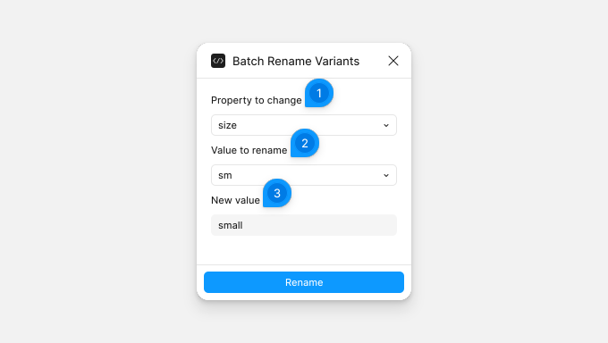

# Batch Rename Variants

Batch Rename Variants renames a variant value in all the component sets you select, for example `size=sm` to `size=small`. It lists only the properties and values that the selected sets share, so the rename reaches every set.

## Rename a value

Select one or more component sets, then run the plugin. The form follows your selection: select other sets and the lists update.

1. **Property to change**: a variant property of the selected sets.
2. **Value to rename**: a value of that property. Every selected set has it.
3. **New value**: the new name for the value. It can be up to 100 characters, without `=` or `,`, since Figma uses those to separate the parts of a variant name.

Click **Rename** to rename the value in every variant that has it. The other properties in each variant's name stay as they are. Press Ctrl/Cmd+Z to undo. The form then updates, ready for the next rename.

If the plugin shows a message instead of the form, select only component sets. If you selected a variant, select its set instead. If the sets share no value, select sets that have a value in common.
